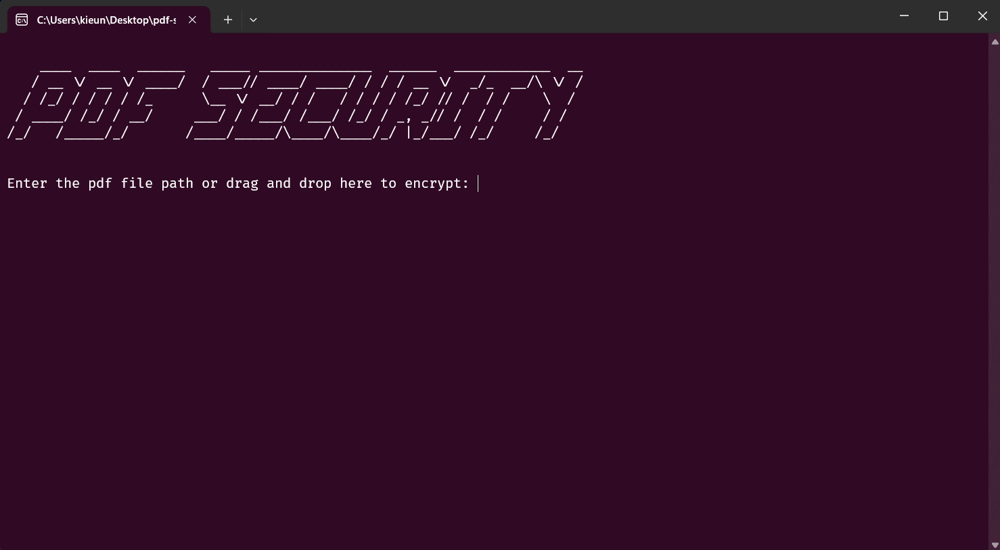

## Python Application - Protect your pdf file with custom password
You can protect your PDF file with a custom password using `Python`

<h4><p align="center"></p></h4>

```
What the program does? 

- Paste your pdf file url or drag and drop to secure
- Protect it with a password 
- A terminal windows program
``` 

## Quick start 

<h4>The simplest method is to install the portable version using the .exe file, available at <a href="fake">this link</a>.
<br>
Or install with <b>python</b>:

### Requirements

* Python
* Python Libraries: `PyPDF2 pwinput pyinstaller`

### Setup 

- Install the dependencies following these steps : 

  - Star this repository
  - <>Code > Download ZIP > Open cmd/terminal in that location
  - Run this command : `pip install -r requirements.txt`
  - Run `main.py`


- If you want to build and creat a .exe program:

  - Run this command : `pyinstaller --onefile --icon=lock.ico  main.py`
  - Your .exe file in your generated dist folder
  
\* The setup for different projects might not be the same. Please refer to the individual setup guides given for each project.
<br>
